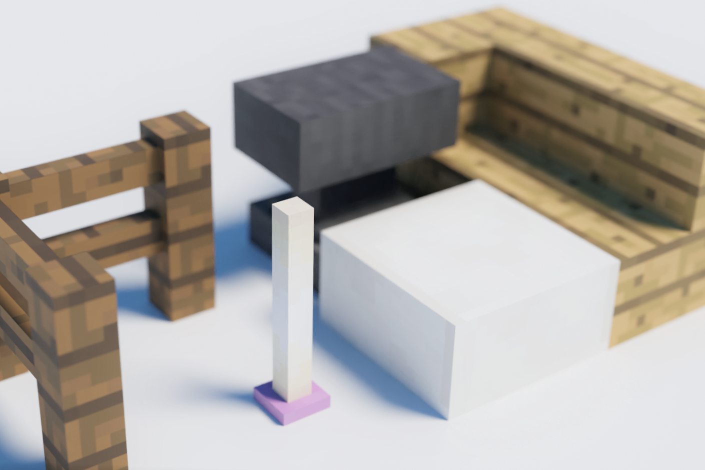

  
MineExporteRは建築をBlender等外部レンダリングソフトに出力するためのMinecraft 1.12.2用のmodです。
バニラ以外の追加ブロックやctmにも対応しているのが特徴です。

> [**English Page**](https://chikage1205.github.io/mexp/en)

## 追加されるコマンド
`/mexp pos1 `  
- 範囲の始点を指定します。

`/mexp pos2`  
- 範囲の終点を指定します。

`/mexp export`  
- 指定された範囲をobjファイルとして出力します。  
- **このとき、optifineを入れている場合はシェーダーを「なし」にしてください**
- **また、描画設定を「描画優先」にしてください。**

## 設定ファイル  
- なし(今後追加予定です)

## 使い方
出力されたデータは _環境フォルダ/MineExporteR_ 下に入っています。
出力されたobjファイルを各レンダリングソフトへインポートしてください。  
**Blenderの場合はScriptingタブから[自作のスクリプト](https://gist.github.com/chikage1205/bb136ee26ebc0f0329ad4893bb4363c7)を実行することでテクスチャのボケや裏面の非表示などを自動で設定してくれます。**

## 注意点
- レンダリングごとにファイルは上書きされます。外部3Dソフトに入れる前に別フォルダに出力ファイルを移動させることを強くおすすめします。

- このmodはベータテストの状態です。正常に出力されないブロックがある可能性がありますが、正式版リリースまでにできる限りマイクラ内での見た目通りに出力できるよう開発を続けています。

- githubで最新版の開発を行っていますが、自己責任でビルドできる方のみそちらを利用してください。動作保証はありません。(その代わり、ここで配布するバージョンはできる限り安定版になるよう努めます)

## ダウンロード
**上記の注意点に同意できる場合のみ、**  [**ここからダウンロードしてください**](https://github.com/chikage1205/MineExporteR/releases)  
最新版のAssets→MineExporteR-(バージョン).jar をクリックで、ダウンロードが始まります

## 既知の不具合、未実装要素
- タイルエンティティが出力されない  
- 一部のctmメソッドが出力されない  
- Chisel mod等に使用されているCTM(optifineとは別)には非対応です
